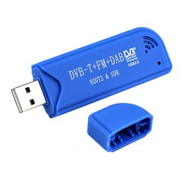
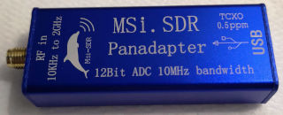

# RTL-SDR

This example code use RTL-SDR dongle as A/D hardware on radiofrequency.

# Steps:

1. install 'rtl-sdr' package: sudo apt install rtl-sdr
2. install Rust compiler as user: https://www.rust-lang.org/tools/install
3. download this source: git clone https://github.com/hg2ecz/sdrtool-example/
4. rtl_tcp -s 2.4M -f 103.3M
5. cd sdrtool-example; cargo run --release --example fmdemod | nc -l -p 8888            # NC server
6. nc IPADDR_OF_NC_SERVER 8888 | aplay -t raw -f S16_LE -r 48000

If you have rtl-sdr and aplay on same laptop, the nc command may be omitted.

This software can run PC&notebook or Raspberry Pi, Odroid and other Single Board Computer.

# MSI SDR

This example code works with MSI SDR dongle:

# Steps:

1. install new 'miri-sdr': git clone https://github.com/f4exb/libmirisdr-4/  # then (cmake . ; make)
2. ...
3. ...
4. ./miri_sdr -s 2400000 -f 103300000 - | nc -l -p 1234
5. modify the examples/fmdemod/src/main.rs:

     ~~let rfdata = tcpcli.read_u8();~~

     let rfdata = tcpcli.read_s16();         // signed 16 bit

and then cargo run --release --example fmdemod | nc -l -p 8888            # NC server

6. nc IPADDR_OF_NC_SERVER 8888 | aplay -t raw -f S16_LE -r 48000
